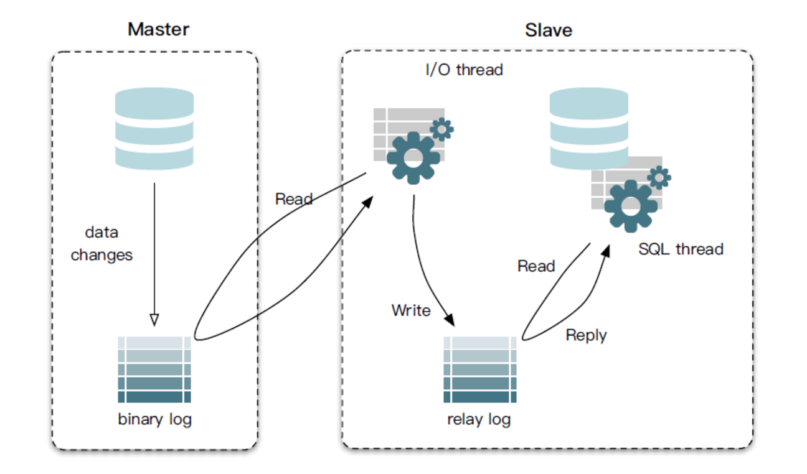
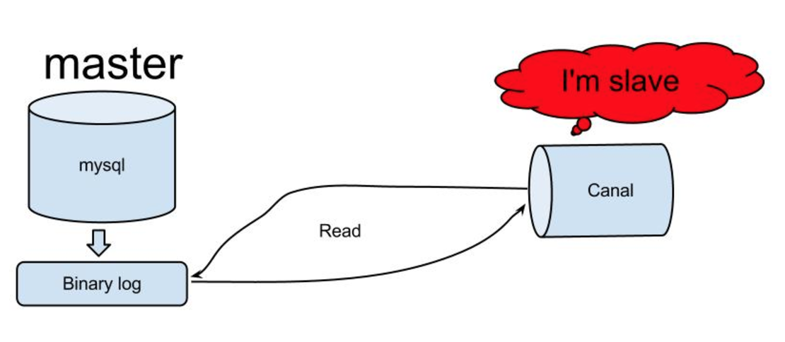

Canal的安装
=========

### Canal介绍
要了解canal是什么，需要先知道mysql中主备复制是怎么一回事：


从上层来看，复制分成三步：
- master将改变记录到二进制日志(binary log)中（这些记录叫做二进制日志事件，binary log events，可以通过show binlog events进行查看）
- slave将master的binary log events拷贝到它的中继日志(relay log)
- slave重做中继日志中的事件，将改变反映它自己的数据
  
而canal取巧的地方在于：


如图所示，原理也相对比较简单：
- canal模拟mysql slave的交互协议，伪装自己为mysql slave，向mysql master发送dump协议
- mysql master收到dump请求，开始推送binary log给slave(也就是canal)
- canal解析binary log对象(原始为byte流)

### 前置条件
- canal的原理是基于mysql binlog技术，所以这里一定需要开启mysql的binlog写入功能，建议配置binlog模式为row：
```csharp
[mysqld]
log-bin=mysql-bin #添加这一行就ok
binlog-format=ROW #选择row模式
server_id=1 #配置mysql replaction需要定义，不能和canal的slaveId重复
```
- canal在与msql server交互的时候是将自己模拟成了slave，所以需要在master上为slave开放权限：
```csharp
CREATE USER canal IDENTIFIED BY 'canal';  
GRANT SELECT, REPLICATION SLAVE, REPLICATION CLIENT ON *.* TO 'canal'@'%';
-- 或者是全部权限
-- GRANT ALL PRIVILEGES ON *.* TO 'canal'@'%' ;
FLUSH PRIVILEGES;
```

