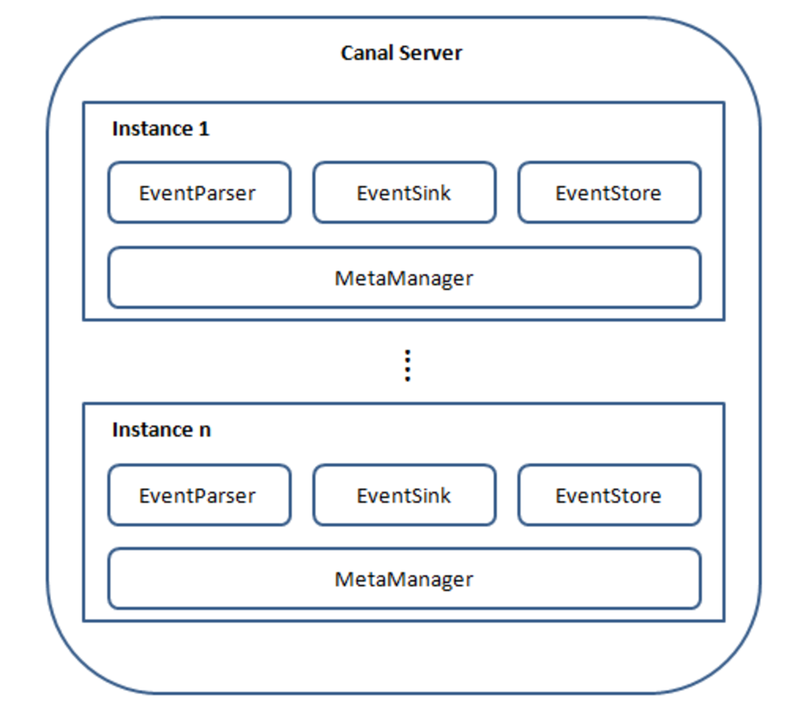
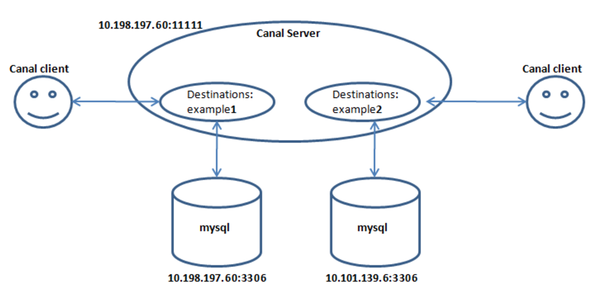

Canal的安装
=========

### Canal介绍
要了解canal是什么，需要先知道mysql中主备复制是怎么一回事：


从上层来看，复制分成三步：
- master将改变记录到二进制日志(binary log)中（这些记录叫做二进制日志事件，binary log events，可以通过show binlog events进行查看）
- slave将master的binary log events拷贝到它的中继日志(relay log)
- slave重做中继日志中的事件，将改变反映它自己的数据
  
而canal取巧的地方在于：


如图所示，原理也相对比较简单：
- canal模拟mysql slave的交互协议，伪装自己为mysql slave，向mysql master发送dump协议
- mysql master收到dump请求，开始推送binary log给slave(也就是canal)
- canal解析binary log对象(原始为byte流)

### canal结构
如下图所示：

说明：
- server代表一个canal运行实例，对应于一个jvm
- instance对应于一个数据队列 （1个server对应1..n个instance)

instance模块：
- eventParser (数据源接入，模拟slave协议和master进行交互，协议解析)-
- eventSink (Parser和Store链接器，进行数据过滤，加工，分发的工作)
- eventStore (数据存储)
- metaManager (增量订阅&消费信息管理器)

在实际工程中，比如常见的业务分库场景。我们的服务端可能会有多个mysql实例，分别对应着一部分业务数据。那么一种可能的canal服务端结构也许会是这样子：


### 运行的前置条件
- canal的原理是基于mysql binlog技术，所以这里一定需要开启mysql的binlog写入功能，建议配置binlog模式为row：
```csharp
[mysqld]
log-bin=mysql-bin #添加这一行就ok
binlog-format=ROW #选择row模式
server_id=1 #配置mysql replaction需要定义，不能和canal的slaveId重复
```
- canal在与msql server交互的时候是将自己模拟成了slave，所以需要在master上为slave开放权限：
```csharp
CREATE USER canal IDENTIFIED BY 'canal';  
GRANT SELECT, REPLICATION SLAVE, REPLICATION CLIENT ON *.* TO 'canal'@'%';
-- 或者是全部权限
-- GRANT ALL PRIVILEGES ON *.* TO 'canal'@'%' ;
FLUSH PRIVILEGES;
```

### canal的配置
上述前置条件具备了之后，就可以来看看如何对canal进行配置。canal有两种配置管理方式：
- manager方式： 和你自己的内部web console/manager系统进行对接。(alibaba内部使用方式)
- spring方式：基于spring xml + properties进行定义，构建spring配置。

我们重点看第二种方式，这也是默认的配置管理方式。在这种模式下，通常需要我们进行设置的地方有两个文件：
- `instance.properties`
- `canal.properties`

不难看出，前者针对的是每个实例，而后者则是针对整个canal服务端；

一份简单的instance.properties配置文件展示如下：
```csharp
#################################################
## mysql serverId
canal.instance.mysql.slaveId = 1234

#position info，需要改成自己的数据库信息
canal.instance.master.address = 127.0.0.1:3306
canal.instance.master.journal.name =
canal.instance.master.position =
canal.instance.master.timestamp =

#canal.instance.standby.address =
#canal.instance.standby.journal.name =
#canal.instance.standby.position =
#canal.instance.standby.timestamp =

#username/password，需要改成自己的数据库信息
canal.instance.dbUsername = canal

canal.instance.dbPassword = canal
canal.instance.defaultDatabaseName =
canal.instance.connectionCharset = UTF-8

#table regex
canal.instance.filter.regex = .\..

#################################################
```

### 启动canal
配置好了之后就可以正式启动canal了：
```csharp
sh bin/startup.sh
```
注意，命令执行之后终端不会被挂起，所以要确认已经成功启动可以通过查看logs目录下的日志输出：
```csharp
vim logs/canal/canal.log
```
或者是具体的instance日志输出：
```csharp
vim logs/example/example.log
```

### canal的HA
canal的HA分为两部分，canal server和canal client分别有对应的实现：
- canal server：为了减少对mysql dump的请求，不同server上的instance要求同一时间只能有一个处于running，其他的处于standby状态
- canal client：为了保证有序性，一份instance同一时间只能由一个canal client进行get/ack/rollback操作，否则客户端接收无法保证有序

更具体的例子可以参考[这里](https://github.com/alibaba/canal/wiki/AdminGuide#user-content-ha%E6%A8%A1%E5%BC%8F%E9%85%8D%E7%BD%AE)。

参考链接：
https://www.cnblogs.com/yulu080808/p/8819260.html
https://github.com/alibaba/canal/wiki/%E7%AE%80%E4%BB%8B
https://github.com/alibaba/canal/wiki/AdminGuide
https://segmentfault.com/a/1190000016626274