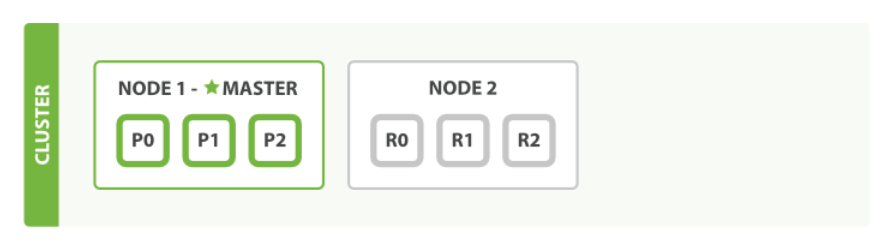

ElasticSearch的一些基础概念
=========

- Elasticsearch中的几种名词关系（类比关系型数据库）：
    ```csharp
    Relational DB -> Databases -> Tables -> Rows -> Columns
    Elasticsearch -> Indices -> Types -> Documents -> Fields
    ```

- ES集群可以包含多个 ***索引***（`indices`），每一个索引可以包含多个 ***类型***（`types`），每一个类型包含多个 ***文档***（`documents`），然后每个文档包含多个 ***字段***（`fields`）；<br/><br/>

- 一个节点（node）就是一个ES实例，而一个集群（cluster）由一个或多个节点组成，它们具有相同的`cluster.name`，它们协同工作，分享数据和负载。<br/><br/>

- ES中实际存储数据的地方是 ***分片***（`shard`），索引只是一个指向一个或者多个分片的逻辑概念；ES中的最小工作单元就是分片，一个分片就是一个lucene实例，并且它本身就是一个完整的搜索引擎；<br/><br/>

- 分片可以是主分片也可以是复制分片（类似于关系型数据库的主备，可以防止数据丢失，另外也能分摊压力）；<br/><br/>

- 主分片的数量在创建之初即定好了不可以修改（这个数量定义了能存储到索引里数据的最大数量（当然实际还是取决于你的数据、硬件和应用场景）），复制分片的数量却可以修改；<br/><br/>

- 像MongoDB一样，在ES中并不需要显式的创建索引（数据库）和类型（表），直接插入一条新的数据ES会自动为你创建好；这里默认创建好的也算是一个集群，一个单一节点的集群。我们也可以添加更多的节点进来，只要后续添加的节点与第一个节点含有相同的cluster.name即可（ES内部会通过广播自动发现第一个节点所在的集群）；<br/><br/>

- 关系型数据库中，增删改查是免不了的，ES亦是如此。除了谁也跑不掉的并发问题，ES还有一些自身特有的问题：
  
  上图假设了一个三节点ES集群的写操作场景。
    - 在ES中新建、索引和删除请求都是写操作，它们必须在主分片上成功完成才能复制到相关的复制分片上：
      1. 客户端发送新建、索引或者删除请求到节点1
      2. 节点使用文档的_id确定文档属于分片0，于是转发请求到节点3，分片0位于这个节点上
      3. 节点3在主分片上执行请求，如果成功，它会转发同步请求到相应的位于节点1和节点2的复制分片上。当所有复制分片报告成功，节点3才会报告成功给请求的节点，请求节点此时返回操作结果给客户端
    - 上面的操作并发问题存在于两个地方：
      1. 更新分片0上的数据的时候
      2. 节点3转发同步消息到复制分片的时候
      > 第一个很容易理解，关系型数据库也会遇到这样的问题；第二个可以想象如果有两个很靠近的更新操作，主片的更新均为成功，此时同步复制请求的发送完全可能会先后倒置，这样一来ES必须要有一定的机制防止乱序到达的复制请求互相覆盖。
    - ES中处理上述并发问题采用的是乐观并发控制机制（每个文档都含有一个_version字段）
    - ES中规定了存储的文档是不可变的。如果我们需要更新已存在的文档，只能是重新索引新的文档，再替换掉之前的：
        ```csharp
        GET /website/blog/1
        ...修改...
        PUT /website/blog/1
        ```
        当然ES也提供了一步到位的update接口。
    - 最后，ES的这些写操作，还有一些细微的调节参数，比较重要的有：
      1. `replication`
         用于控制上述复制行为；默认值是sync，这将导致主分片得到复制分片的成功响应后才返回。也可以设置为async，但是你将不会知道操作是否已经成功复制到所有复制分片上，并且还有可能导致过多的写请求压垮ES；
      2. `consistency`
         默认主分片在尝试写操作的时候需要规定数量或者过半的分片可用（可以是主分片也可以复制分片），这是防止数据被写入到错的网络分区，计算公式为：
         `int( (primary + number_of_replicas) / 2 ) + 1`
         这个api参数要注意跟`discovery.zen.minimum_master_nodes`设置区分，二者要达到的目的可以说是很相似的，有点殊途同归的味道<br/><br/>

- ES中存储的文档，数据实际最终是被存储在lucene上的。而lucene仅仅支持键值对方式的扁平化存储，要将这个json文档存储到lucene中我们除了需要将有层级的json对象扁平化为`[字段:值]`方式的键值对，还需要解决下面两个问题：
  1. json对象并没有携带关于字段类型的信息
  2. 如何为string类型的字段建立倒排索引
   
    ES中的两个概念映射（mapping）和分析（analysis）就是用来解决上述两个问题的。<br/><br/>

- 通过mapping我们将json字段匹配到lucene中一种确定的数据类型，lucene支持的常见数据类型有：`string`、`byte`、`short`、`integer`、`long`、`float`、`double`、`boolean`、`date`；
  会遇到自定义字段mapping的情况不多，因为基本的数据类型已经能够应付大多数的情况；偶尔需要自定义的一般来说是json中的string字段，比如一个简单的例子，可能一个英文方式表达的日期`Feb,12,2016`，这个时候如果你也想将该string看作是日期类型的话，自定义mapping就可以派上用场了<br/><br/>

- 前面有提到ES会在插入第一条数据的时候自动为我们创建索引和类型；这个动作也可以我们自己手动来完成，这个时候创建索引你可能会感兴趣一些参数、属性设置：
    ```csharp
    PUT / blogs 
    {
        "settings": {
            "number_of_shards": 3,
            "number_of_replicas": 1
        },
        "mappings": {
            "tweet": {
                "properties": {
                    "tweet": {
                        "type": "string",
                        "analyzer": "english"
                    },
                    "date": {
                        "type": "date"
                    },
                    "name": {
                        "type": "string"
                    },
                    "user_id": {
                        "type": "long"
                    }
                }
            }
	    }
    }
    ```
    这里同样也展示了一下自定义mapping的设置，手动设置mapping的时候，针对string类型主要有两个参数需要注意：
    1. `index`，可选值analyzed、not_analyzed、no
    2. `analyer`，用来给该字段进行分词的<br/><br/>
- sdf
  
参考链接：
https://www.cnblogs.com/zhukunrong/p/5224558.html