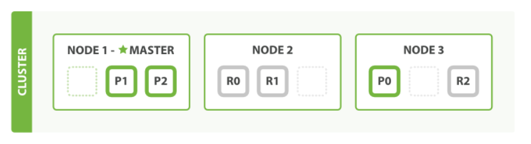
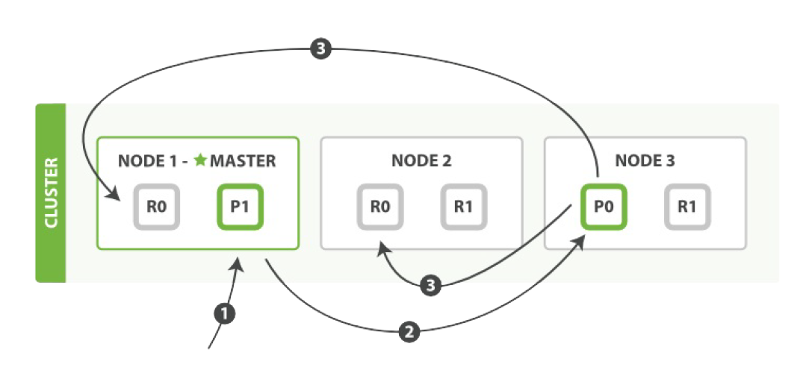

ElasticSearch的一些基础概念-part1
=========
#### 以下描述均基于ES 6.x版本
#### 与关系型数据库类比
Elasticsearch中的几种名词关系（类比关系型数据库）：
```csharp
Relational DB -> Databases -> Tables -> Rows      -> Columns
Elasticsearch -> Indices   -> Types  -> Documents -> Fields
```

ES集群可以包含多个 ***索引***（`indices`），每一个索引可以包含多个 ***类型***（`types`），每一个类型包含多个 ***文档***（`documents`），然后每个文档包含多个 ***字段***（`fields`）。

一个索引应该是因共同的特性被分组到一起的文档集合。例如，你可能存储所有的产品在索引products中，而存储所有销售的交易到索引sales中。虽然也允许存储不相关的数据到一个索引中，但这通常被看作是一个反模式的做法，[官方](https://www.elastic.co/guide/cn/elasticsearch/guide/current/mapping.html)并不推荐这样的作法。

#### ES节点（node）
一个节点（node）就是一个ES实例，而一个集群（cluster）由一个或多个节点组成，它们具有相同的`cluster.name`，它们协同工作，分享数据和工作负载。

当一个节点被选举成为主节点时（又叫做`协调节点`），它将负责管理集群范围内的所有变更，例如增加、删除索引，或者增加、删除节点等。而主节点并不需要涉及到文档级别的变更和搜索等操作，所以当集群只拥有一个主节点的情况下，即使流量的增加它也不会成为瓶颈。

#### ES分片（shard）
ES中实际存储数据的地方是 ***分片***（`shard`），索引只是一个指向一个或者多个分片的逻辑概念；ES中的最小工作单元就是分片，一个分片就是一个lucene实例，并且它本身就是一个完整的搜索引擎。

分片可以是主分片也可以是复制分片（类似于关系型数据库的主备，可以防止数据丢失，另外也能分摊压力）；当集群规模扩大或者缩小时，ES会自动的在各节点中迁移分片，使得数据仍然均匀分布在集群里。如下集群初始状态下拥有两个节点，每个节点含有三个分片：

当集群节点数增加至3个时，分片被自动重新分配：


主分片的数量在创建之初即定好了不可以修改（这个数量定义了能存储到索引里数据的最大数量（当然实际还是取决于你的数据、硬件和应用场景）），复制分片的数量却可以修改；一个主分片能存储的文档数是固定的（int.max-128），同时考虑到集群收缩和扩容时迁移分片的开销，主分片的数量需要认真评估与考虑。

像MongoDB一样，在ES中并不需要显式的创建索引（数据库）和类型（表），直接插入一条新的数据ES会自动为你创建好；这里默认创建好的也算是一个集群，一个单一节点的集群，我们也可以添加更多的节点进来。比如当我们在同一台机器上启动第二个节点时，只要它和第一个节点有同样的cluster.name配置，它就会自动发现集群并加入到其中。但是在不同机器上启动节点的时候，为了加入到同一集群，需要配置一个可连接到的单播主机列表（`discovery.zen.ping.unicast.hosts`）。

#### ES中的数据
不同于传统关系型数据库存储数据时需要对数据进行建模，NoSQL下我们存储的就是一个个现实世界中的对象。当然在NoSQL的世界中通用的数据传输标准是json，当一个对象被序列化成为json，它就被称为一个json文档。

在ES中，每个字段的所有数据都是[默认被索引的](https://www.elastic.co/guide/cn/elasticsearch/guide/current/data-in-data-out.html)。即每个字段都有为了快速检索设置的专用倒排索引。而且不像其他多数的数据库，它能在同一个查询中使用所有这些倒排索引，并以很快的速度返回结果。

文档被索引后包含一些比较重要的元数据信息：
- `_index`
  文档存放在哪里。索引名字必须小写，不能以下划线开头，不能有`.`号，最大长度不能超过255 byte
- `_type`
  虽说同种类的数据放在同一个索引下，但它们也只是松散的组合在一起而已。如果明确定义一些数据中的子分区会是很有用的，_type就是用来提供这样一种逻辑分区的。
  一个_type命名可以是大写或者小写，但是不能以下划线或者句号开头，不应该包含逗号，并且长度限制为256个字符
- `_id`
  文档的唯一标识，可以由ES提供也可以自行提供；建议是直接使用ES提供的自动生成id
- `_source`
  ES在该字段存储代表文档体的JSON字符串，有充足的[理由](https://www.elastic.co/guide/cn/elasticsearch/guide/current/root-object.html)让你保留这个字段而不是禁用它，所以放置默认就好

在存储或者说索引了文档之后ES又引入了类型的概念。思考下ES中的类型（包括文档类型以及文档中每个字段的类型）是如何来实现的？

首先[lucene中没有](https://www.elastic.co/guide/cn/elasticsearch/guide/current/mapping.html)文档类型的概念，它只是简单的将一个文档以键值对的形式存储下来。ES每个文档的类型名被存储在_type元数据字段上，当需要检索某个类型的文档时，ES通过在_type字段上使用过滤器限制只返回这个类型的文档。

ES中我们可能会在一个索引里存储不同的文档类型，不同的类型其mapping可能会有所不同，也可能会很相似。但最后落到lucene中“mapping”只会有一个（所有类型mapping的一个并集，lucene又不知道type这种说法）！

这会导致两个有趣的结果：
- 如果要存储两个不同的类型，每个类型都有同名的字段但映射不同，你会直接收到一个异常
- 更进一步如果类型间相差巨大的话，底层lucene存储效率会折半（最糟糕的情况，两个类型所有字段完全不一样），索引中将有一半的数据是空的从而最终导致性能问题

其次lucene也没有映射的概念。在lucene中，一个文档由一组简单的键值对组成。值没有做类型区分而是统一被当作bytes处理。ES将复杂json对象转换到lucene能够识别的键值对的过程就叫做映射。

通过mapping我们将json字段与ES类型信息之间的映射关系保存下来。ES支持的常见数据类型有：`string`、`byte`、`short`、`integer`、`long`、`float`、`double`、`boolean`、`date`。

#### ES中的mapping
通过上面的描述我们知道了每种类型都有它自己的[映射](https://www.elastic.co/guide/cn/elasticsearch/guide/current/mapping-intro.html)。映射定义了类型中的字段，每个字段的数据类型，以及ES如何处理这些字段。映射也用于配置与类型有关的一些元数据。

要查看一个类型对应的mapping信息，你可以：
`GET /gb/_mapping/tweet`
这会返回类似下面的结果：
```csharp
{
   "gb": {
      "mappings": {
         "tweet": {
            "properties": {
               "date": {
                  "type": "date",
                  "format": "strict_date_optional_time||epoch_millis"
               },
               "name": {
                  "type": "string"
               },
               "tweet": {
                  "type": "string"
               },
               "user_id": {
                  "type": "long"
               }
            }
         }
      }
   }
}
```

ES中创建mapping有两种方式：
- 创建索引的时候指定mapping：
```csharp
PUT /blogs 
{
    "settings": {
        "number_of_shards": 3,
        "number_of_replicas": 1
    },
    "mappings": {
        "tweet": {
            "properties": {
                "tweet": {
                    "type": "string",
                    "analyzer": "english"
                },
                "date": {
                    "type": "date"
                },
                "name": {
                    "type": "string"
                },
                "user_id": {
                    "type": "long"
                }
            }
        }
    }
}
```
- 通过编程的方式[指定mapping](https://www.elastic.co/guide/en/elasticsearch/client/net-api/current/attribute-mapping.html)

尽管在很多情况下基本域数据类型已经够用，但我们还是经常需要为单独域自定义映射，特别是字符串域。自定义映射使得我们可以：
- 全文字符串域和精确值字符串域的区别
- 使用特定语言分析器
- 优化域以适应部分匹配
- 指定自定义数据格式 

需要注意的是mapping在一开始给定了之后，后续使用过程中我们几乎无法修改一个类型的mapping信息。因为这样做的话会导致已经被索引了的数据变得无效，所以通常一开始的时候就需要我们尽量定义好mapping文件；

一定要修改的话只能是使用新的mapping信息重新建立新的索引了。当然，某些修改仍然是可行的，比如我们决定在tweet映射增加一个新的名为tag的not_analyzed的文本域：
```csharp
PUT /gb/_mapping/tweet
{
  "properties" : {
    "tag" : {
      "type" :    "string",
      "index":    "not_analyzed"
    }
  }
}
```

最后，为了方便ES也支持[动态映射](https://www.elastic.co/guide/cn/elasticsearch/guide/current/dynamic-mapping.html)，概念比较简单这里就不作过多描述了。

#### ES中的并发控制
数据存储到ES中后我们肯定会需要读取它们，简单的查询是非常方便的，这里只单独说说数据读取时的并发控制。

在ES中处理并发采用的是[乐观并发控制](https://www.elastic.co/guide/cn/elasticsearch/guide/current/optimistic-concurrency-control.html)机制，即每个文档都含有一个_version字段。我们可能的更新动作有两类：
- get -> update -> index
- 直接update

第一种方式中整个更新动作的时间窗口比较大，再加上请求在网络上来回很容易有并发修改的情况发生，这在采用乐观锁的机制下大概率会导致执行很多无效的动作从而浪费资源。

我们建议采用第二种方式，主要就是省掉了多个请求的网络来回，让更新的时间窗口更小。update内部会使用检索文档当前的_version号，并传递版本号到重建索引步骤的index请求。如果发生冲突可以指定一个重试次数`retry_on_conflict`，非常方便。

另外_version还支持自定义，比如我们本身要导入到ES中的数据行就包含自己的版本信息列（version，timestamp等），那么可以直接通过`version_type=external`来指定，这里有两点需要额外注意下：
- 外部版本号取值为java中的ulong
- es使用外部版本号进行判定时不是精确=而是<=（current_ver <= external_ver）

最后，我们来看看ES的分布式特性在并发控制中还会带来的特有问题：


上图假设了一个三节点ES集群的写操作场景。在ES中新建、索引和删除请求都是写操作，它们必须在主分片上成功完成才能复制到相关的复制分片上：
1. 客户端发送新建、索引或者删除请求到节点1
2. 节点使用文档的_id确定文档属于分片0，于是转发请求到节点3，分片0位于这个节点上
3. 节点3在主分片上执行请求，如果成功，它会转发同步请求到相应的位于节点1和节点2的复制分片上。当所有复制分片报告成功，节点3才会报告成功给请求的节点，请求节点此时返回操作结果给客户端

上面的操作中并发问题可能存在于两个地方：
- 更新分片0上的数据的时候
- 节点3转发同步消息到复制分片的时候
> *第一个很容易理解，关系型数据库也会遇到这样的问题；
第二个可以想象如果有两个很靠近的更新操作，主片的更新均为成功，此时同步复制请求的发送完全可能会先后倒置，这样一来ES必须要有一定的机制防止乱序到达的复制请求互相覆盖。*

最后，ES的这些写操作，还有一些细微的[调节参数](https://www.elastic.co/guide/cn/elasticsearch/guide/current/distrib-write.html)，比较重要的有：
- `replication`
 用于控制上述复制行为；默认值是sync，这将导致主分片得到复制分片的成功响应后才返回。也可以设置为async，但是你将不会知道操作是否已经成功复制到所有复制分片上，并且还有可能导致过多的写请求压垮ES

- `consistency`
 默认主分片在尝试写操作的时候需要规定数量或者过半的分片可用（可以是主分片也可以复制分片），这是防止数据被写入到错的网络分区，计算公式为：
 `int( (primary + number_of_replicas) / 2 ) + 1`
 这个api参数要注意跟`discovery.zen.minimum_master_nodes`[设置](https://www.elastic.co/guide/en/elasticsearch/reference/6.7/discovery-settings.html)区分，二者要达到的目的可以说是很相似的，有点殊途同归的味道，都是为了避免在发生网络分区故障（network partition）的时候进行**写**操作，进而导致数据不一致。

#### ES分析器
前面的mapping信息中，对于不是string的field，一般只需要设置type即可；而针对string类型有两个参数值得注意：
- `index`，可选值`analyzed`、`not_analyzed`、`no`（不索引，该field不会被搜索到）
- `analyer`，用来给该字段进行分词

这里的analyer也就是ES中的分析器了，其主要工作就是用来分词并执行标准化（normalize）的。总的来说一串字符串会按顺序依次经过分析器三个模块的处理：
1. 字符过滤器
2. 分词器
3. token过滤器

ES提供了开箱即用的字符过滤器、分词器和token过滤器，这些可以组合起来形成[自定义的分析器](https://www.elastic.co/guide/cn/elasticsearch/guide/current/custom-analyzers.html)以用于不同的目的。另外，我们只能搜索在索引中出现的词条，所以索引文本和查询字符串必须标准化为相同的格式（即都过同一种analyer处理）。

可以使用analyze API来查看文本是如何被分析的，我们在消息体里指定分析器和要分析的文本：
```csharp
GET /_analyze
{
  "analyzer": "standard",
  "text": "Text to analyze"
}

// 或者
post http://127.0.0.1:9200/abc2/_analyze/
{
  "field": "FullName", // 使用指定field对应的analyzer来分析text值
  "text": "库存商品" 
}
```

汉语和英语的分词规则必然不一样，默认的analyzer可能无法很好的与汉语结合工作，因此我们需要指定特定的analyzer。可以在两个层面做这件事：
```csharp
PUT http://127.0.0.1:9200/test/
{
  "settings": {
    "analysis": {
      "analyzer": "ik_smart" // 对整个test索引有效
    }
  },
  "mappings": {
    "goods": {
        "properties": {
            "title": { // 对单独某个字段有效
                "type":      "string",
                "analyzer":  "my_analyzer"
            }
        },
       "dynamic_templates": [
        {
          "for_test_only": {
            "match": "FullName", // 对单独某个字段有效
            "match_mapping_type": "string",
            "mapping": {
              "type": "text",
              "analyzer": "ik_smart"
            }
          }
        }
      ]
    }
  }
}
```


参考链接：
https://www.elastic.co/guide/cn/elasticsearch/guide/current/index.html
https://www.elastic.co/guide/en/elasticsearch/guide/master/index.html （版本可能有些旧但能提供一个很好的大纲）
https://www.cnblogs.com/zhukunrong/p/5224558.html


