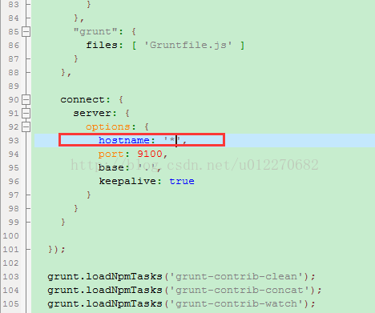
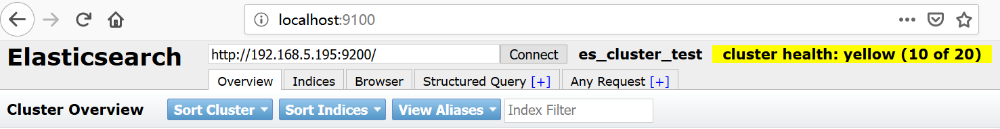

ElasticSearch的安装
=========

### 前置条件
一些比较重要的前置条件（windows、linux下均适用）需要先声明一下：
- 目前（2019.5.9）.net client支持到的ES最高版本是6.7.1，而ES插件启动似乎对版本要求颇为严格，所以尽管ES版本已经走到了7.x，所以想要很方便的使用 .net client还是老实使用6.7.1版本吧
- 关于jdk的版本，官网[这个地方](https://www.elastic.co/guide/en/elasticsearch/reference/current/setup.html)有详细的说明；虽然7.x的ES已经随款绑定了一个open jdk（版本是12.x），但是另一方面Oracle jdk也是可以使用的。考虑到之前Oracle jdk的使用面极广，所以一个小小的准则是：
    - 如果有历史包袱，兼容性考量，那么建议选用Oracle jdk，版本是1.8.x
    - 没有负担的话，就选用open jdk，毕竟官方明确说到推荐用这个，版本是12.x

### window下的安装
在windows下快速的安装，进行快速的验证，上生产环境再考虑切换到linux不失为一个好办法。所以windows下的安装还是有必要了解下，能帮助我们能快速开始。
1. 如果没有jdk，那么准备好jdk，将jdk所在目录添加到环境变量path，同时创建一个名为JAVA_HOME的环境变量
2. windows下使用msi安装包自然是更省时省力的做法，双击运行即可
3. next的过程中，有些步骤可以多说两句：
    - 首先确定安装路径，***注意路径中不要有中文、不要有空格!!!***
        > 曾遇到过一个问题就是因为路径中有空格导致了分词插件无法加载 
    - 需要指定data，config以及log文件的路径，通常来说不建议这三者跟ES本身放在一起，因为有很高的风险在ES升级的时候会被误删除，所以如果能放在其它路径下最好
    - msi安装时直接操作界面当然方便，上述三者路径如果想手动配置也是可以的
        - elasticsearch.yml文件下path.data -> data
        - elasticsearch.yml文件下path.logs -> logs
        - 环境变量ES_PATH_CONF -> config 
    - 纯粹想要速度做快速验证之类的话，推荐用cmd直接运行ES的方式，不建议安装成windows service
### linux下的安装
todo。。。

### 安装后的配置
ES的各种配置分别放置在三个文件中：
- `elasticsearch.yml`，我们主要打交道的就是这个文件
- `jvm.options`，该文件用来设置ES使用的JVM各种选项
    jvm的配置选项遵循一套特殊的规则，了解下还是很有意思的：
    - 注释用\#
    - 所有选项用`-`开始，比如-Xmx2g
    - 以-Xmx2g为例，选项之前可以添加JVM版本范围前缀：
        - 没有前缀，表示适用于所有版本的JVM
        - 8:-Xmx2g，表示仅适用于JVM 8
        - 8-:-Xmx2g，表示适用于JVM 8及其以上版本
        - 8-9:-Xmx2g，表示适用于JVM 8到9之间所有版本
- `log4j2.properties`，用于配置ES的日志系统

比较重要的配置项描述如下：
- path.data、path.logs，前面已经描述过了
- cluster.name，要想组集群，这个选项非常关键，因为只有当节点的cluster.name都一样的时候，它们才会抱团形成集群；另外，单一节点也可以设置该值，至少提供一个有意义的名称也是很有帮助的
- node.name，提供一个有意义的名称也是很有帮助的
- network.host，默认值是127.0.0.1，运行单一节点的时候这个值很方便；而如果是要组集群，则不能绑定到回环地址上
    > 一旦你为network.host提供了新值，ES会认为你此时是从debug环境迁移到生产环境，因此会开启更为严格的startup检测，所以有时候设置了该值，可能会导致ES启动不了就是这个原因
- http.port、transport.port，当ES的默认网络端口被其他应用抢占了端口时，可以使用这两个配置重新分配新的端口
- discovery.seed_hosts，在默认情况下ES会绑定到回环地址，并且检测同一台server上9300-9305这个端口范围，并试图抱团其它可能存在的node组一个默认集群出来；这对于单机快速验证是非常有用的；
但是如果是真实的集群环境，其它节点的地址就需要通过该选项来配置了。同时请注意配在这里的节点都是master-eligible的
- cluster.initial_master_nodes，选项的名称叫master_node，但其实应该是master-eligible node，就是为了在集群初始话的时候，认可这些备选master的投票，所以理论上来说就是将集群中你所有的master-eligible节点全部记录在此即可，像下面这样：
    ```csharp
    cluster.initial_master_nodes: 
   - master-node-a
   - master-node-b
   - master-node-c
    ```
- heap size，默认ES分配了1g的内存空间给JVM使用；一些关于JVM内存设置的最佳实践有：
    - 将最小堆大小（`Xms`）和最大堆大小（`Xmx`）设置为一样的值（原因在于如果不一致，很有可能在使用过程中JVM会调整堆大小以满足需求，导致`世界暂停`）
    - Xmx的值不要超过物理内存的一半
    - 打开bootstrap.memory_lock选项（在elasticsearch.yml中）。意图很简单，就是为了防止JVM分配好的内存被操作系统换出到磁盘，影响ES的效率

### web管理
目前使用的是`elasticsearch-head`web管理端。虽然很丑，但是功能还算完备，[项目维护](https://github.com/mobz/elasticsearch-head)也还行。
- 单一节点集群没有试过head能不能正常跑，但既然是用上head了多半也就是跟集群打交道了。所以节点的配置应该也是按照集群的要求来的，也因此elasticsearch.yml中network.host之类的选项记得打开

- 在此基础之上，添加如下配置：
    ```csharp
    http.cors.enabled: true 
    http.cors.allow-origin: "*"
    ```
    > 不太清楚是否集群中所有节点的elasticsearch.yml都需要添加，但是我只是在部署了elasticsearch-head节点上做了添加，也能正常使用

- 安装node.js，下载地址：https://nodejs.org/en/download/
  - cmd进入到node.js的安装路径，执行：
    ```csharp
    npm install -g grunt-cli
    ```  
  - 试试`grunt -version`以确定上述命令执行成功
- 下载elasticsearch-head，`git clone`或者直接下载zip包都可以，随意解压到一个路径，但是保险一些还是建议路径中不要携带中文、空格之类的
- 修改 \elasticsearch-head-master\Gruntfile.js文件：
  
- 修改elasticsearch-head-master_site\app.js文件：
  
  这个地址就是上面提到过的network.host，如果你有改动的话这里最好改成一致的（更方便），虽然本地访问localhost也是没有问题的
- cmd进入elasticsearch-head解压目录，执行：
  ```csharp
  npm install
  ```
  速度很慢的话可以试试国内的镜像：
  ```csharp
  npm install -g cnpm --registry=https://registry.npm.taobao.org
  ```
- 安装成功后启动elasticsearch-heads：
  ```csharp
  npm run start
  ```
- 访问下http://localhost:9100 验证站点是否部署成功：
  

### 分词插件
分词插件推荐使用[es-ik](https://github.com/medcl/elasticsearch-analysis-ik)。

- 要小心的版本问题，ES对插件版本似乎是严格匹配的，所以仔细看看github主页上关于ik的版本说明，确定选择合适的版本
- 直接选择编译好的release版本，解压后放到$ES_HOME\6.7.1\plugins路径下，ES启动时会自动加载该插件
- 如果是集群部署的话，需要在所有节点机器都安装ik插件
- 如果启动不了，请首先确定下ik所在的整个路径中是否含有中文或者空格

**参考地址：**
https://www.jianshu.com/p/4467cfe4e651
http://www.cnblogs.com/zlslch/p/6440373.html


