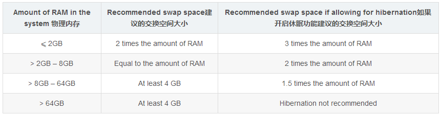
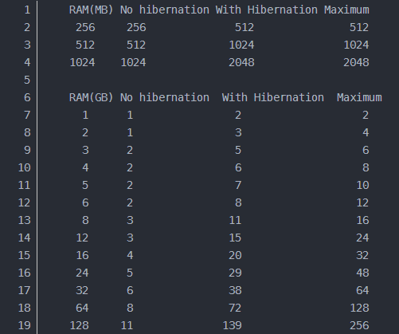

linux的安装
=========

#### 这里介绍一些较为通用的思路、方法
我们并没有局限于linux的版本，可能其它发行版会有一些特殊的步骤或者要求，但是基本思路应该还是一样的。

- 下载介质，这个不用多讲了，各个发行版的官网上应该都有提供下载链接
- 将镜像刻录到U盘上，一般来说直接使用UltraISO即可。具体步骤就不展示了，往上随手一搜大把的资料
- 准备硬盘
    - 对于双系统安装来说，一种方式是通过windows的磁盘管理压缩出来一些空间给linux用
    - 压缩完成之后，会出现一个未分配的`可用空间`。因为linux没有什么c盘d盘的概念，只有分区挂载目录的概念（*你分配好一段空间，然后挂载某个目录比如 `/usr`，那么`/usr`也差不多就算是一个分区了*）。所以这块较大的空间不要去格式化它，保证其“未分配”的属性即可
        >  *注意：记住这个空间的大小，后面安装的时候基本只能靠大小来判定哪个空间是linux的；如果手滑不小心搞到windows的空间上去了。。。你懂的*
    - 你当然可以用一块新的硬盘作为linux的安装盘
- 重启，U盘启动
    - 正常情况下，U盘已经能正常引导linux安装程序了
    - 一个例外：
        - 在我安装Centos 7的时候，U盘似乎不能正常引导
        - 进入引导界面，按下`e`（版本不同也可能是`tab`）键
        - 你会看到`vmlinuz initrd=initrd.img inst.stage2=hd:LABEL=CentOS\x207\x20x86_64 rd.live.check quiet`
        - LABEL的值被编码了，含有两个空格。这样似乎该值的长度就超过了windows系统卷标支持最大长度，安装引导找不到安装介质也就没法继续下去了
        - 知道了原因，解决办法倒也简单。在刻录U盘启动盘的时候，记得改一个长度合法的卷标名，然后修改上面LABEL的值即可
- 正常引导了之后，后续的步骤跟着系统安装程序的指引一步步操作即可。当然这之中还是有值得提到的点：
    - 关于启动方式
    启动方式分为`Legacy` 和 `UEFI`，现如今的电脑想要找到不是UEFI启动的怕是很难了；
    启动方式决定了我们引导分区的挂载方式：Legacy挂载/boot，而UEFI则是有另外的分区：
        - ubuntu，直接选择eif分区
        - centos则是挂载/boot/efi
    - 关于分区
    一般比较重要的几个分区及其大小建议：
        - swap，根据物理内存大小来设置，下面是两种linux发行版的官方建议：
        redhat：
        
        ubuntu：
        
        - /home，类似于windows下的user。如果你是个娱乐向的用户，我建议最好能分配稍微大点，因为你的图片、视频、下载内容基本都在这里面；
        - /usr，类似于windows下的program files。搞开发的，自然这个分区给大一点
        - /var，搞开发的需要注意这个分区。系统或者某些软件的日志记录或者临时数据什么的都会打到这个分区上面，出于稳定性的考虑应该把这个分区单独挂出来；当然如果你是普通用户的话就不用在意了
        - /tmp，程序运行过程中创建的临时数据会放在这里（似乎系统重启时会自动删除该分区）。搞开发的话，这个分区同/var一样，最好也独立出来然后大小尽量给大一点
        - /，根分区，上面的空间分配完毕之后，剩下的大小我们都给这个分区即可
- 关于卸载
某一天，当你想回归到windows卸载掉linux时，需要：
    - 下载[EasyUEFI](https://www.easyuefi.com/index-us.html)
    - 删除掉当前linux的引导记录，恢复windows引导的主控权，这样下次开机的时候就会回到以前直接启动进入windows了
    - 在磁盘管理中直接无脑删掉linux的所有分区，要小心不要删错了
    - 前两步你不要作，照做即可，主要是怕把引导记录给搞坏掉，到时候连windows也进不去就好玩了
- 虚拟机环境下网络配置
一般来说如果我们主要工作平台是windows的话，多半会选择采用虚拟机的方式使用linux系统。所以，安装好操作系统之后，第一件要解决的事情就是网络搭建，而这又是跟所使用的虚拟机特定相关的。
网上能搜索到的一般都是讲vmware的网络配置的，但实际上你也不用太过担心，hyperv的网络设置也大同小异区别并不是很大。
vmware总共支持三种方式的网络模型，分别是：
    - 桥接
    - nat
    - host-only

    对应hyperv中也有：
    - 外部
    - 内部
    - 专用

    因为host-only在实际使用中局限颇多（支持的场景太少），所以我只会简单说说桥接跟nat两种模式，够用就好，更为细节的知识还是google的好。
    桥接简单来说就是虚拟机跟宿主机在同一个网络中，地位对等，共同从网关获得ip地址；所以，如果你的局域网设备较多ip紧张，可能这种方式就不是太合适了。
    hyper中默认的虚拟交换机是一个nat交换机，因此如果要使用桥接模式网络的话，还需要自己新建一个`外部`交换机。
    nat模式的话，虚拟机是在宿主机的背后自成一个内网。所有的请求都会从宿主机的nat设备走转发。内网中的所有虚拟机都能互相访问，也能访问到宿主机。但是如果你有两朵nat内网，互相之间的虚拟机想要访问配置起来就比较麻烦了，要做端口映射。可是想想，搞开发的，会用到的框架程序何其多，端口转发得配置多少？所以，个人感觉还是尽量使用桥接模式吧，这个更为方便。

#### 参考链接：
https://blog.csdn.net/ysy950803/article/details/52643737
https://blog.csdn.net/s717597589/article/details/79117112
https://www.cnblogs.com/pualus/p/7835422.html
https://blog.51cto.com/yangrong/1288072
https://www.jianshu.com/p/455ea0af98af
https://www.jianshu.com/p/b7cf5539429c

