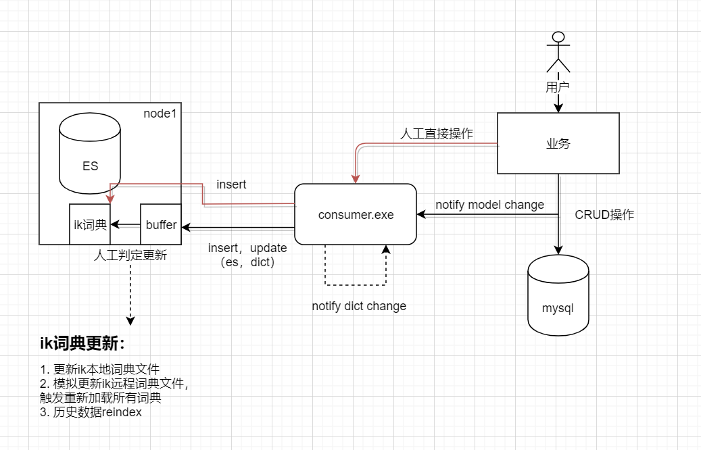

#### 初始状态
2-3台es节点

#### 索引规划
大致上有两种方案：
- 所有数据放在一个索引下面
- 提前拆分出预期数据规模增长会很快的商户，剩下的放同一个索引

差别不大，其实第二种就是第一种的更进一步表现形式。考虑到现阶段商户数以及数据规模，现在商城已经有几个大的客户，建议采用第二种方案。

#### 容量规划
容量规划的话，主分片数可能最终确定为10个（要么通过标准流程压出来一个极值要么先猜一个），副本数初期可以设置为1（可以很方便调整，初期我们不需要很大的吞吐量尽量节省资源）

注意，es中分片个数（包括主分片和副本分片）跟节点个数存在一些微妙的关系，设置副本数的时候除了考虑备份的意义外还需要考虑到负载均衡。因为es搜索的性能取决于最慢的节点的响应时间，所以尝试均衡所有节点的负载是一个好想法。

举例来说主分片数2，副本数1，节点数3，这种配置算下来会造成有一个节点包含两个分片，这样的负载就不算是最均衡的；通过将副本数配置成2，我们就能让每个节点均衡的分摊两个分片（有一个节点包含两份同样都是副本的分片，这是没有任何问题的，[没有必要](https://www.elastic.co/guide/cn/elasticsearch/guide/current/replica-shards.html)确保主分片均匀地分布在所有节点中）！

初期给定的主分片数有可能随着业务的发展变得不再合适，这个时候就需要考虑迁移扩容。这里面需要分情况讨论：
- **节点个数小于主分片个数**
  这种情况下我们是可以通过添加节点直接进行扩容的，并且此过程不需要任何人工干预，es就能帮我们搞定
- **节点个数已经等于主分片个数**
  此情况中再添加节点对于扩容而言没有意义起不到任何作用，可以考虑将整个旧索引迁移至拥有更多分片规划数的新索引上去；也可以考虑另一种新旧多索引共存的[变通方法](https://www.elastic.co/guide/cn/elasticsearch/guide/current/multiple-indices.html)
- **另外还有一种稍微特殊点的情况**
  分片个数还好但是分片中的某些热点数据已经明显表明需要独立出来，这个时候也会需要进行数据迁移

迁移扩容时一个主要问题是需要上层应用停机维护，当然这是有规避办法的。我们可以为大客户的独立索引使用索引别名达到零停机更新的目的；至于存放在一个共用大索引上的小客户，索引别名不合适（数量过多），因此可能需要允许停机更新。

#### 全文检索方案
es中文分词插件我们直接上ik，这已经是一个事实标准直接用即可。中文全文检索的准确性依赖于词典文件的更新，而每次更新都意味着现有索引中的数据已经过期需要重建。

ik自身提供了词典热更新机制，虽然有一定的问题，但是仍可以绕过达到效果。在热更新前后衔接上，上游数据库有相关更改时canal+kafka保证能够拿到对应的DML；下游需要确保刷新ik自身的扩展词典，这里有几个地方比较关键：
- 除了数据库的增删改，可能还会遇到需要直接刷新词典的情况

- 刷新动作需要做批处理，不能来一次更新一次（也会需要超时兜底）

- ik的扩展词典[并不会区分业务](https://github.com/medcl/elasticsearch-analysis-ik/issues/399)，而索引则是明显携带了业务信息的
> 索引中的不同类型甚至不同索引之间默认情况下都共用的同一份词典，如何处理词典与索引、类型之间的对应关系？现阶段我们不区分业务，默认整个集群就共用同一份扩展词典文件。（徒手实现区分业务似乎也有一定的难度参考[这里](https://github.com/medcl/elasticsearch-analysis-ik/issues/399)和[这里](https://github.com/medcl/elasticsearch-analysis-ik/issues/546)）

- 当前索引中既有数据需要全部reindex一次，reindex也有两种方式：
	- 涉及少量数据的情况下，scroll检索旧有文档，随后bulk update
	- 大量数据的话，新建索引然后scroll检索旧有文档，随后bulk insert

> 涉及到新建索引也会需要考虑停机问题，此时就能体现索引规划中选用第二种方案的优势。在独立出来的大商户索引中我们可以通过事先规划索引别名的方式达到零停机reindex；统一大索引在此种情况下则只能执行bulk update方式的reindex，不过因为能在统一索引中的商户量级都比较小，所以这些操作可能也都还好。

#### 数据建模
数据建模主要涉及到关联关系的处理和mapping文件的构造。

##### 商品
商品基本信息，权限信息，分类信息，查询条件；价格和库存按照现有的方式关联查询，es中不做处理。
```json
"mappings": {
    // 基础信息
    "GID(bigint)": 123, 
    "profileid(int)": 123, 
    "名称(FullName varchar500)": "abc", // text
    "简称(BriefName varhcar100)": "abc", // keyword
    "拼音简写(EasyCode varchar500)": "abc", // keyword
    "规格(Spec varchar500)": "24*200ML", // text（简单分词，按空格或者逗号之类的）
    "型号(Pattern varchar500)": "24*200ML", // text
    "用户编码(Code varchar50)": "abc", // keyword
    "用户自定义字段1(UF1 varchar500)": "abc", // text
    "用户自定义字段2(UF2 varchar500)": "abc", // text
    "用户自定义字段3(UF3 varchar500)": "abc", // text
    "用户自定义字段4(UF4 varchar500)": "abc", // text
    "商城显示标题(bas_goods_ex:goodtitle varchar500)": "abc", // text
    "tnode_商城(varchar50)": "", // not_analyzed
    "pnode_商城(varchar50)": "", // not_analyzed
    //"pnodename_商城": "", // not_analyzed
    "isparent_商城(tinyint)": 1, 
    "parentid_商城(bigint)": 123, 
    "sonno_商城(int)": 123,
    "TotalSons_商城(int)": 123,
    "tnode_erp": "", // 同上
    "pnode_erp": "", // 同上
    //"pnodename_erp": "", // 同上
    "isparent_erp": 1, // 同上
    "parentid_erp": 123, // 同上
    "sonno_erp": 123, // 同上
    "TotalSons_erp": 123, // 同上
    // 业务特定
    "条码": {
        "type": "nested", // 用nest对象来表达
          "properties": {
            "uid(单位id bigint)": { "type": "long"  },
            "deal1id(int)": { "type": "int"  },
            "deal2id(int)": { "type": "int"  },
            "deal3id(int)": { "type": "int"  },
            "barcode": { "type": "string" } // not_analyzed
        }
    },
    // 冗余，主要用于加速查询
    "条码2": ["barcode1", "barcode2", "barcode3"], // not_analyzed
    "属性": {
        "type": "nested", // 用nest对象来表达
        "properties": {
            "dealid(int)": { "type": "int"  },
            "fullname(varchar100)": { "type": "string"  } // not_analyzed
        }
    },
    "属性2": ["fullname1", "fullname2", "fullname3"], // not_analyzed
    "录入时间indexTime": "2019-11-25 09:05:00" // range搜索，主要用于更新索引
}

// 权限项单独分离用于优化更新操作
"mapping": {
    "GID(long)": 123,
    "profileid": 123,
    "权限not in_商城": ["用户id1", "用户id2", "用户id3"], // not_analyzed
    "权限not in_erp": ["用户id1", "用户id2", "用户id3"] // not_analyzed
}
```

#### 方案落地
前面虽然一直有提到系统的各个部分我们采用canal+kafka做衔接，但其实不依靠它们手动进行通知也能实施该方案。无非一个是canal自动触发各种事件，一个是人工进行触发。后者虽然麻烦（对业务代码侵入性比较高）不过也有其存在价值。

下面的设计中我们就是暂时去掉了canal+kafka，系统结构大致如下所示：


##### 消息事件
在考虑尽量使用现有系统技术栈的前提下，我们选择已有的activemq消息队列做事件推送，需要关注的事件主要有：
- 词典更新
- es存储对象增、删、改

我们需要设计消息让其能够表达这两种类型的事件，可以将上述事件分别独立看待，也可以不区分类型做统一处理。另外注意消息体大小对于activemq处理速度的影响，一种优化措施是让消息体仅包含最低限额的标识信息（id，type等），在消费端单独再去取完成业务所需的具体数据。

对于词典更新来说，要考虑到可能是主动更新也可能是被动的因为es存储对象的更新而更新。可能的一种消息体结构是：
```json
{
	"op": "refresh_dict",
	"insert": ["word1", "word2"],
	"update": [{
		"old": "word1",
		"new": "word2"
	}],
	"delete": ["word1", "word2"]
}
```

es存储对象事件对应的消息体结构可能是：
```json
// 增、删、改es存储对象也会进一步导致触发词典更新事件消息
{
    "op": "insert",
    "ids": [1,2,3],
}
// 删
{
    "op": "delete",
    "ids": [1,2,3],
}
// 改
{
    "op": "update",
    "ids": [1,2,3]
}
```
不难看出我们是将两种事件区分对待了。

##### 同步程序
也就是我们的消息消费程序，以exe形式存在负责消费上述两种类型的消息。需要实现的功能大概有：
- 对词汇的修改分类，确定哪些涉及更新大商户索引，哪些涉及更新统一索引（优先级、队列）
  - 增
    需要修改词典文件
  - 删
    取决于业务需求，可能需要对应修改词典文件也可能不需要
  - 改
    取决于业务需求，比如允许存在旧词汇那么直接忽略它即可
- 可能会进行一次预处理过程，根据客户词典的特定需求
  > *比如一个特殊词汇，被分词后也包含特殊词汇，这个时候如果没有预处理（比如组合出所有几个特殊词汇）那么就有可能导致某些词搜索不出来*
- 消费队列，一次做一个批量动作（或者也可以多个不同索引并发修改）
  - 更新扩展词典
  - 触发ik刷新（通过更新远程词典来实现）重载词典
  - 历史数据reindex
    - 重载词典之后新的数据会继续进来并正常分词，如何确定历史数据？目前考虑加时间戳
    - 如果支持多个类型并发修改，这里要能进行区分
  - 继续消费队列

可能需要注意的点有：
- 消费端要尽可能做好失败处理（重试，抛出异常等）
- 可能需要做幂等处理
  
##### es的操作接口
主要目的是提供给上层做查询es使用，以dll形式存在。不过该操作接口中还存在另一类逻辑即，触发es存储对象增、删、改事件：
```csharp
// 通知（触发）一次insert事件
eshelper.NotifyInsert(long[] ids);
// 通知（触发）一次delete事件
eshelper.NotifyDelete(long[] ids);
// 通知（触发）一次update事件
eshelper.NotifyUpdate(long[] ids);
```
注意，上述方法需要与实际对象发生在关系型数据库中的操作一起做事务化，避免产生不一致状态。


