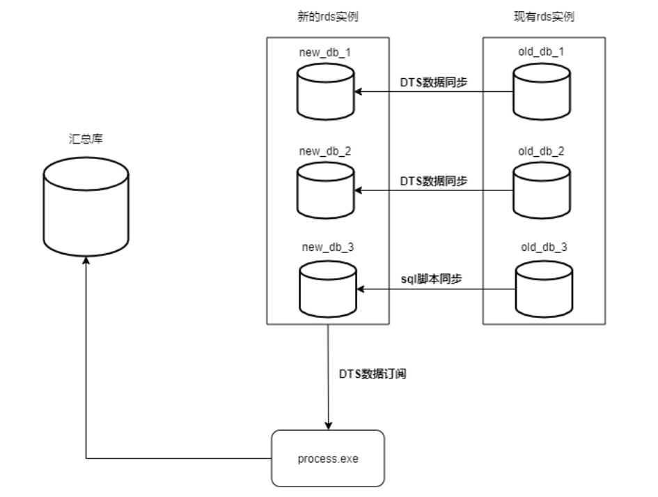
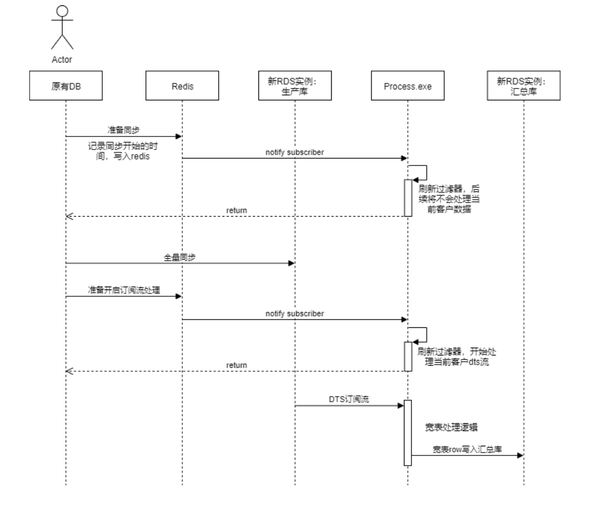
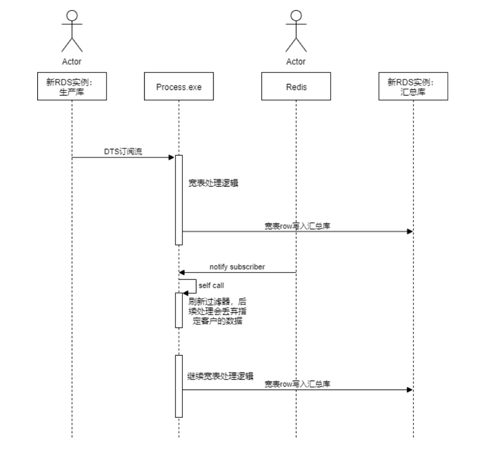

### 宽表处理逻辑

#### 概述
整体思路其实是非常简单的（复杂麻烦的地方都在具体的实现细节上）：

如上图所示，整个宽表处理分三步发生：
1. **初始全量迁移**
旧有生产库上的数据在商户开通服务之后通过阿里云的dts数据同步服务直接同步到新的rds实例上
2. **增量数据处理（宽表化）**
process.exe配合阿里云的dts数据订阅服务对实时增量数据做处理
3. **导入汇总库**
所有宽表化之后的数据全部导入最后的汇总库，汇总库负责向上层提供各种查询服务

##### 一些说明：
1. 旧有的生产库上数据存放有两种情况：
- 一些大型的商户独占数据库
- 多个小型商户挤在一个数据库上

> 大型商户的数据迁移通过阿里云的dts数据同步服务，小商户的话可以通过sql脚本文件直接导入

2. 数据处理也存在两种情况：
- 通过历史数据宽表计算逻辑进行处理
- 通过process.exe进行处理

3. 历史数据宽表计算
这里的历史数据其实就是初始全量迁移的那部分数据；
这部分的计算逻辑也会表现为一个exe程序。我们需要这个exe的原因很简单，初始全量数据是没有流经process.exe的。

4. 全量数据的计算跟增量数据的计算会有小部分重叠，可以解决问题不大。

##### 一些考虑：
- 业务本身不复杂，但是会带来新的复杂度
- 程序本身的复杂度

这两点使得本身很简单的程序要想能实际落地被使用，就要加很多的处理，处理实际情况中会遇到的问题，主要体现在：
- **调试、测试**
当出错需要重来时每次人工做状态重置回滚会非常麻烦耗时，最简单方便的是可以直接重置整个环境重新测试。然而这在数据量巨大的情况下，每次重走一次程序的初始化导入流程显得很不实际（大客户数据量可以在千万级，如果出错导致数据需要重置，那么每次重置都从新过一次process.exe的耗时将是不可接受的）

- **线上尽量不停机**
类似上面，新客户开通服务之后第一步就是初始化导入流程。同样的，数据量大的情况下耗时会很高。同时注意不同于测试的时候，生产环境此时一个dts订阅通道下面可能会挂上多个客户。这就很有可能导致其中的某个大客户初始导入直接卡住其它小客户的正常dts订阅处理。

针对上述问题，目前的解决办法是让初始导入这一步通过数据库对数据库的方式直接做掉，而不是过一次process.exe。客户开通服务之后，后台开始dts同步老库到生产库（prod库），同时生产库也开通dts同步到汇总库；当同步完成后，汇总库跟生产库镜像一致，剩下的我们需要补上汇总库应有的xxx_w宽表数据。

速度问题应该不用担心了，dts同步或者直接执行sql导入脚本怎么都会比process.exe处理更快。然而这种方式也会存在自身的问题：主要是prod库导汇总库的过程，要知道prod此时是有可能已经在对外提供服务了的，那prod上的事务就会跟xxx_w宽表的计算逻辑有重叠。如果能够严格分开这两个过程就不会存在重叠问题了。

**来看基于这样思路的一个方案：**
前一个步骤不变，老库dts同步到prod库，prod库再级联dts同步到汇总库。这一步我们可以在用户确定开通该服务之后就一直这样挂着进行着。时间到了晚上的某个节点，此时系统整体使用率很低，我们可以开始进行下一步。

首先是断开老库跟prod库的dts同写步，实际上可能更早的时候就可以断开了。因为决定同步老库到prod库之后读写请求就已经只会落到prod库上来了，老库可能只有因为命令延迟而落到其上那么几个读写请求而已（在我们的场景中，不少小商户会挤在一个库上所以可能命令延迟造成的落在其上的读请求会更多一些，不过不影响，我们有很多时间可以等待这个过程）。

接着，我们需要断开prod库跟汇总库的dts同步。这一步划重点，让整个过程变得简单就是因为在这里我们允许有那么1分钟左右的系统暂停（实际暂停时间可能会更短）！这一分钟我们需要做一件非常重要的事情：将在发出断开同步命令之后到实际阻挡用户使用prod库之间落入的读写请求全部排干排尽。

如此我们便可以放心断开prod库跟汇总库的dts同步，也就意味着它们之间的同步已经完成。这个点上我们可以在process.exe中打开当前开通服务的这个商户的标志让其可以开始处理该商户的dts同步数据了，紧接着也就能够恢复系统暂停了。如你所见整个过程实际上处理动作可能根本要不了1分钟，大部分情况下10秒内应该可以结束战斗。

【最后再来看看汇总库，现在汇总库的数据将是一份“静态”的数据，我们可以开始计算xxx_w宽表数据了，因为是静态的所以想计算多久就计算多久。静态二字我加了引号因为这是相对静态的。我们用时间来做划分，系统恢复之前的时间是静态数据，恢复之后的动态数据就由process.exe加以处理并同步。】

现在的问题是因为只能卡停1分钟左右，历史宽表数据是不可能在这么短的时间内计算完的。所以1分钟之后我们打开process.exe的时候历史宽表是正在计算中的。一方面我们需要精确区分历史宽表与恢复之后的增量变更数据（用时间？可能难度有点大）；另一方面如果增量变更牵扯到了历史宽表中的数据，二者之间就纠缠在一起了感觉很难想。还是又回到了刚才问题的原点。

**再来看看还有一种变形方案：**
如果就是允许可以重叠会怎样？第一个步骤还是不变不过我们需要提前通知process.exe不要处理xxx商户的数据（process.exe此时是一直运作着的处理着其它商户的dts数据流）。等到老库可以切换到prod库上的时候，我们先通知process.exe可以开始处理xxx商户的数据了然后才进行切换。之后prod开始对外提供服务，xxx_w宽表数据的计算开始进行同时process.exe也一直跑着。

有什么不同？比起之前需要手动人工去划分“静态”前后的数据在这里只需要被动接受两次通知即可。重叠的部分当然还是有，现在就在process.exe收到通知开始处理xxx商户数据，同时发出指令开始切到prod的过程中还有请求落到老库上，这些请求会被同步到prod上进而被process.exe也一并处理，这部分数据就算是被历史宽表计算逻辑和process.exe重复处理的了。

#### 时序图
最后附上程序处理的基本时序图。以下为宽表处理第一次全量导入的时序图：

以下为宽表处理增量处理的时序图：

