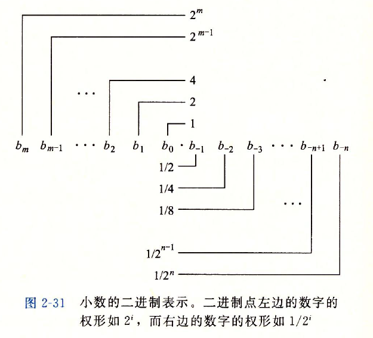
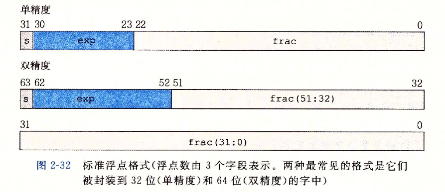
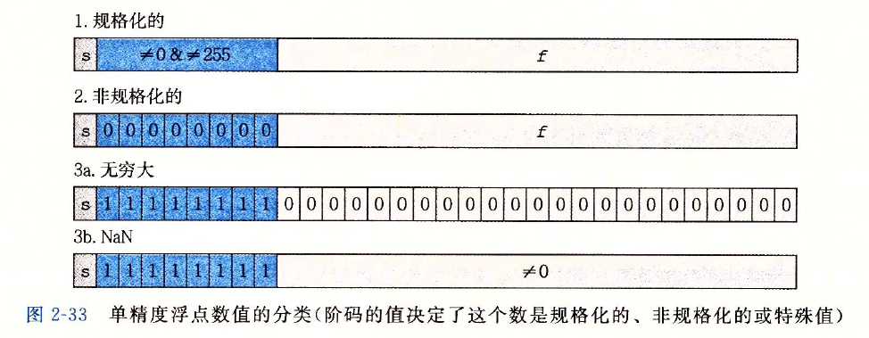

浮点数
=========

浮点数其实是很简单的。数就是一个数字，一个有理数；而浮点，表示的是一种编码方案，将有理数编码存放在字节中的格式。这种编码方案是有标准的，即[IEEE标准754](https://zh.wikipedia.org/wiki/IEEE_754)。

#### 定点数
与浮点相对应的是定点数，它更简单，我们先来看看。

 
 上面这幅图展示了定点数在二进制下的表示，图很简单易懂也不需要过多的说明，整个数值b最终为：
$ b = \sum_{i=-n}^m i^2 \times b_i $

比如，$101.11_2$表示数字：
$ 1\times2^2 + 0\times2^1 + 1\times2^0 + 1\times2^{-1} + 1\times2^{-2} $
$ = 4 + 0 + 1 + \frac{1}{2} + \frac{1}{4} $
$ = 5\frac{3}{4} $

定点数的缺点在于没有**变化量**。小数点位置确定了之后，取值范围也就定了下来。相对于浮点来说，其可表示的范围是比较窄小的：
- 表示一个很大的数，比如$ 5 \times 2^{100} $这将是在101的后面再放上100个0（位模式），定点考虑成本的情况下根本不可能完成
- 表示很小的数时，绝大部分二进制位都将是0，浪费比较严重，精度相当低；

浮点数引入了变化量，即它的阶码。用阶码来乘上尾数部分，相当于小数点左右移动若干位，由此得名浮点数。

#### IEEE浮点数
IEEE浮点标准用$ V = (-1) ^ s \times M \times 2 ^E $的形式来表示一个数：
- 符号
 一个单独的符号位单独编码s，s决定了该数是一个正数（s=1）还是负数（s=0）
- 尾数
 尾数M（frac，n位）是一个二进制小数，单精度编码下有23位，双精度编码下有52位：
 $ frac = f_{n-1}...f_1f_0 $
- 阶码
 阶码E（exp，k位）的作用是对浮点数加权，权重是$ 2^E $，单精度编码下有8位，双精度编码下有11位：
 $ exp = e_{k-1}...e_1e_0 $

下图是上述描述的图例展示：

根据exp的值，被编码的值可以分成三种情况，第三种情况又有两个变种：

我们分别来看看：
- 第一种情况规格化的值是最普遍的情况。当exp的位值不全为0也不全为1时就属于这种规格化的情况。此时，简单的记住：
$ E = e - Bias $
其中，e是无符号数，位表示为$ e_{k-1}...e_1e_0 $；而Bias定义为=$ 2^{k-1} - 1 $，由此E的取值，单精度格式下是-126 ~ 127，双精度格式下是-1022 ~ 1023
M被定义为$ 1 + f $（这多出来的1是向阶码借来的），而f的二进制表示为$ 0.f_{n-1}...f_1f_0 $，因此M被表达为了$ 1.f_{n-1}f_{n-2}...f_0 $，我们因此而多获得了一个精度位！
- 第二种情况阶码域全为0，此时所表示的数是非规格化形式的。在这种情况下：
$ E = 1 - Bias $，而尾数$ M = f $，阶码全为0是借不来那个1的了。
你可能会好奇为什么会有非规格化形式的存在，它的存在解决了两个问题：
    - 提供了一个表示数值0的方法；在规格化的情况中，总是有$ 1 \leq M \lt 2 $，因此无论如何我们是表示不了0这个值的
    - 因为已经可以表示0了，所以0到1之间这一段的数也是能够表示的了
- 第三种情况就是用来表达各种特殊值的，此时阶码域全为1：
    - 当小数域全为0，整个值根据s的取值可以是$ +\infty $或者$ -\infty $
    - 当小数域非0时，结果值被成为NaN（Not a Number）

#### C#中的浮点数

#### 数据库中的浮点数

